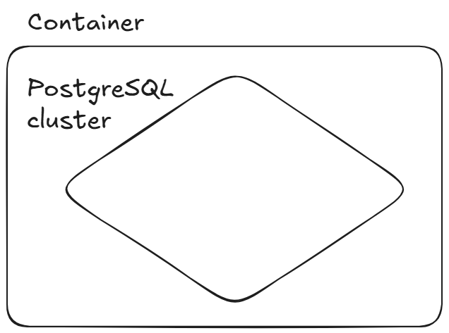
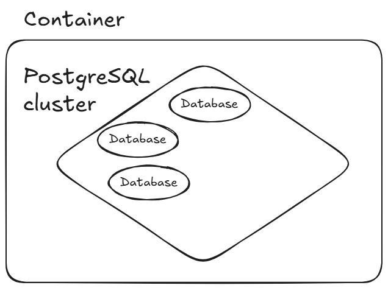
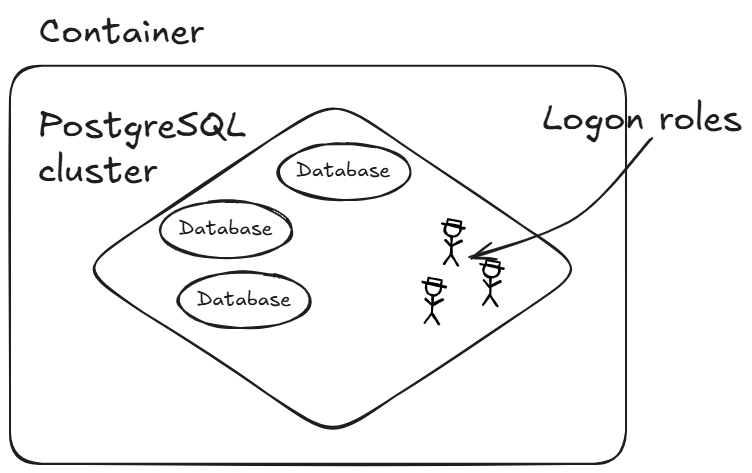
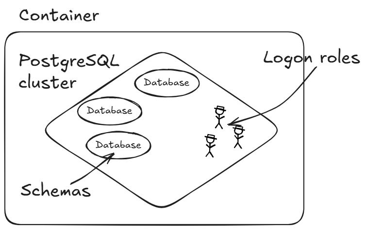

# Oracle DBA discovers PostgreSQL
### Ilmar Kerm & Priit Piipuu
### set-date-here

---

# Whoami: Priit Piipuu

Database performance engineer at FDJ United
Oracle Ace Pro
Member of Symposium 42
Blog: https://priitp.wordpress.com,
@ppiipuu.bsky.social

---

# Whoami: Ilmar Kerm

Database administrator at FDJ United
Oracle Ace Associate (ex-Pro)
Member of Symposium 42
Blog: https://ilmarkerm.eu,
@ilmarkerm.eu

---

# And the story begins...

From installation to first steps to production usage

"the only database that exists today" (ref to how everything in the database world today is PG related and this is the only database modern devs think exists)
"the linux of databases"

<!--
Similar concepts, similar words (PG cluster, database, roles and schemas)
Tablespaces in Oracle and PostgreSQL
Partitioning
There's a plugins for everything, sometimes more than one
Observability
DRCP and that networks thing versus pgbouncer and cats and dogs
Transactions, cursors and stuff
-->

---

# Getting started, through Docker

<!--
While running databases in k8s haven't been popular in our company, containerized environments are
essential for swd development these days. Testcontainers make possible to run the integration tests in your laptop,
what not to like?!
-->

---

<!--
Size matters: smaller containers are easier to user. For example, in case of testcontainers, smaller image makes
the tests run faster. But there's a catch.
-->

---

<!--
If plugins used for daily life change database behavior in some way, then these plugins must be added to the
development containers as well. So after some pluggins and pgbouncer...
-->

---

# Installation: buy or build

How do you add neccessary plugins?

---

k8s + PGCloudNative

the tastiest bit - automated and almost online major version upgrade

---

# Compiling from source: Confronting fear is the destiny of the PGMaster

Compiling Postgres from source is actually quite straight-forward and easy
Example:

---

# In search for a concepts guide...

Same concept, different implementation, much confusion
Same word, different meaning, even more confusion

<!--
People tend to assume that same word means same thing in Oracle and PostgreSQL. Well...
Saying that "database in PG is like PDB" is misleading due to the differences
-->

---

<!--
PostgreSQL cluster contains configuration, memory structures and common processes. Reminds Oracle instance.

Some objects are cluster level: roles, databases, tablespaces
-->

---

<!--
Every PG instance manages one or more databases. Database in PG is the topmost hierarchical level of organizing SQL objects and stuff. 
-->

---

<!--

Login roles are database server level objects. Role can represent either database user or group of users. Roles can own database objects and can assign privileges on those objects to other roles. 
-->

---

<!--
Schema in PG is a logical namespace. Database objects can be reassigned between schemas.
-->
---

# Database in PostgreSQL

Topmost hierarchical level for organizing SQL objects
Databases are isolated, but can access cluster-level objects

---

# Schema

### In Oracle

Tightly coupled with user account
Every user gets its own schema
Schema contains the data owned by user

### In PostgreSQL

Logical namespace for named objects

---

# Deployment options

Cloud-native deployment: one PostgreSQL server, one database, one application

<!--
Because lack of workload isolation makes it very hard to do other deployment models
-->

---

# Tablespaces

### Oracle

Quotas, export/import, configuration and stuff

### PostgreSQL

A glorified symlink

---

# Transactions

### Oracle

Error aborts the statement

### PostgreSQL

Error aborts the statement and transaction
savepoints are possible, but more expensive

---

# MVCC

### Postgres

Delete and rollback are cheaper

---

# DDL statements

### Oracle

DDL statement commits the transaction

### PostgreSQL

DDL is transactional

<!--
But what is the real-life use case for transactional DDL, since objects will get AccessExclusiveLock?
-->

---

# Partitioning for OLTP (I)

Data life cycle management: dropping old partition is faster than delete
Old data can be archived or made available from secondary storage (hybrid partitioning with Parquet)
Works really well with time series

But... ask do you actually need it. In Postgres there is less need.

---

# Partitioning for OLTP (II)

Downside: most of the queries do not benefit from partition pruning

<!--
For example: show me my last 10 transactions
-->
---

---

---

---

# Partitioning for OLTP: global indexes

do not exist

---

# Workload separation

### Oracle

### PostgreSQL

---

# Scaling

PostgreSQL is single instance
How to scale horizontally

poolers: pgbouncer, pgdog
yugabyte and others

---

# Security

User authentication
* OAuth?
* CMU pg_ident
* TLS thing we do with pg_ident

ROLE is a cluster level thing, not database object

---

Oracle practices that are also essential to Postgres

* huge_pages

---

memory management

---

Things that Oracle has and you'll miss in PG

* APEX

Things you just have to accept and live with

* XID wraparound
* occasionally doc says to rebuild indexes
* Long idle transactions (on hot standby)

---

Things that PG has and you can't believe you had to live without
And thing that Oracle marketing shouls as revolutionary, but PG had had them for ages

multiple server side programming languages
!!! predictable major version release dates

---

Things that Oracle has, but actually are meh

* ASM
* TDE

---

Simulating things to get close or exceed to oracle features

Compression -> btrfs or san/nas
Encryption -> LUKS/cryptsetup
ASM -> LVM
Tracing! -> 10046, 10053, ...
OEM -> the Roman thing, Prometheus+Grafana
resource manager -> systemd limits
out-of-place patching

NB! In Postgres, you are EXPECTED to use external tools, OS tools, extensions to add missing features
Postgres Core is intentionally slim

---

Yes, Postgres has these enterprise Oracle features for free

* Parallelism
* Database links
* Direct IO
* Centrally managed users
* Active Data Guard
* GoldenGate

---

Stop worrying about collations

builtin.UTF-8 has arrived

---

High availability

Patroni
How clients find highly available database servers (PG connection strings), not all drivers are created equal

---

Query planning

---

Migration strategies

what we do, overview of datamover

switchover steps

what about pl/sql

---

Real time replication from Oracle

extracting data from oracle be hard

Debezium
* Logminer - emoji of dying from slowness
* OLR
* and if you have the license X-Streams (this is what we do)

---

Backups... maybe not much to say and skip

---

Cloud provider proprietary Postgres vs stock PG

just discussion
pros cons

kinda sucks that cloud providers develop their own custom features and don't contribute it

---

Monitoring!!!

The Roman thing

---

Developer experiences from migration

how have devs reacted
some issues raised
data type mappings. TIMESTAMP(9) feels stupid, but it was widely reported.
learnings
how helpful was AI during code migration

---
