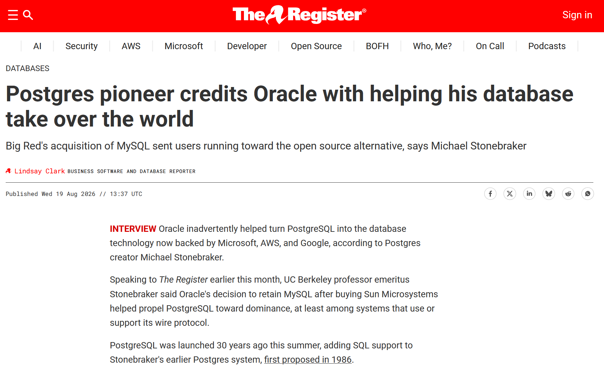
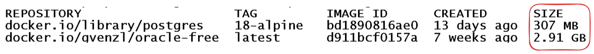
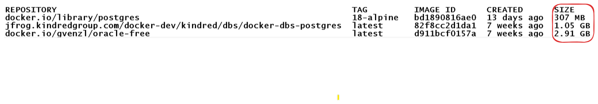
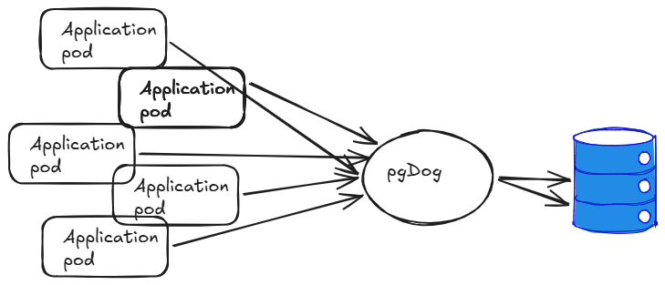
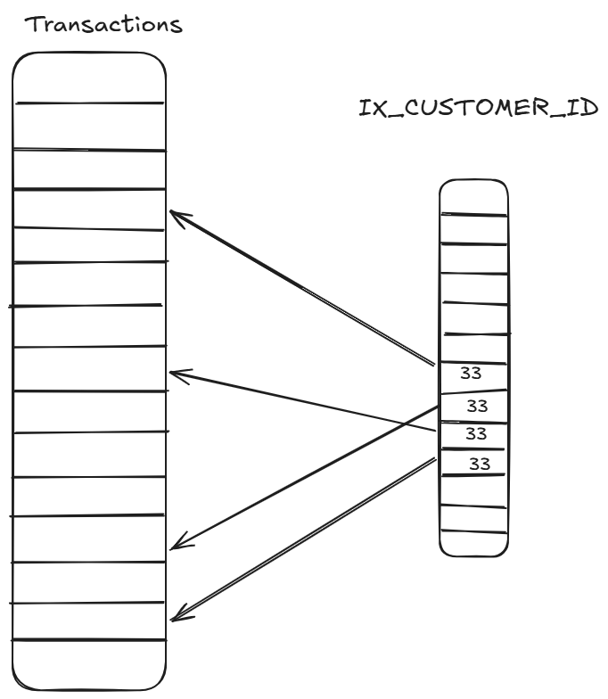
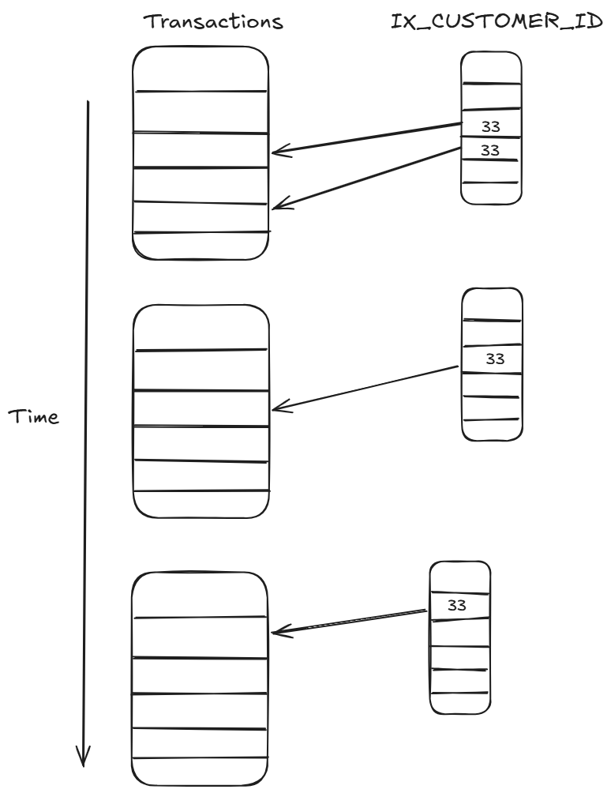
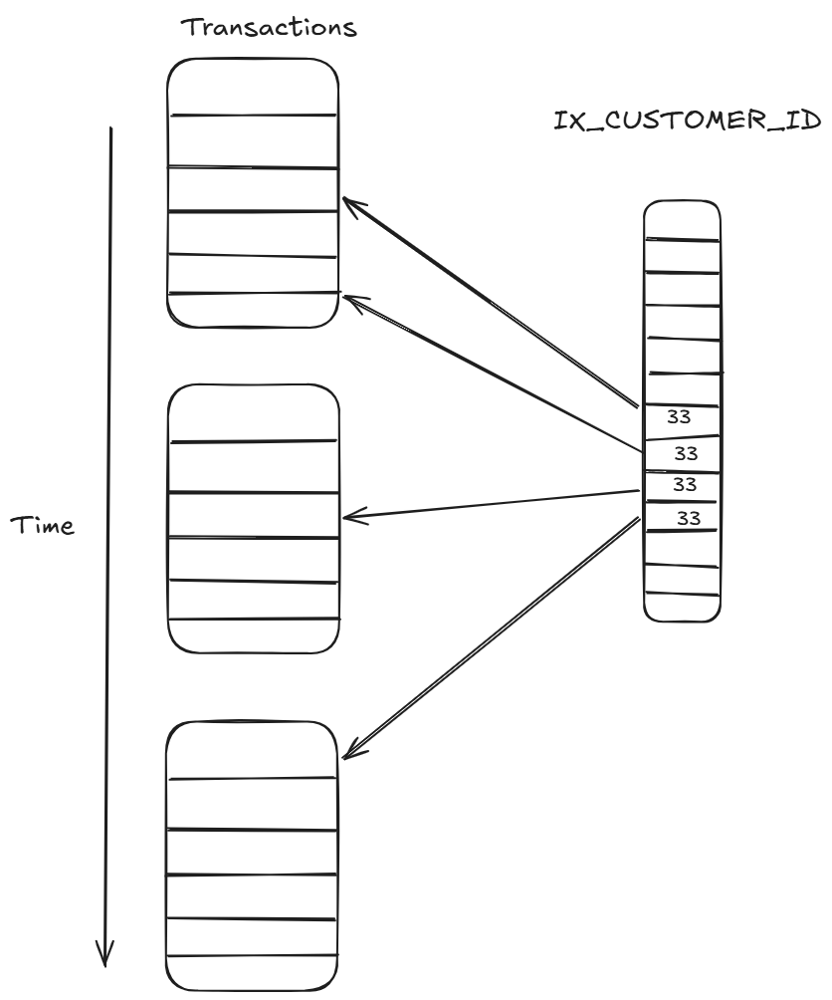

# Oracle DBA discovers PostgreSQL
### Ilmar Kerm & Priit Piipuu
### set-date-here

---

<!-- _class: columns -->
<div>

# Whoami: Priit Piipuu

Database performance engineer at FDJ United
Oracle Ace Pro
Member of Symposium 42
Blog: https://priitp.wordpress.com,
@ppiipuu.bsky.social

</div>

<div>

# Whoami: Ilmar Kerm

Database administrator at FDJ United
Oracle Ace Associate (ex-Pro)
Member of Symposium 42
Blog: https://ilmarkerm.eu,
@ilmarkerm.eu

</div>

---


---

# The rise of PostgreSQL

"The only database that exists today"
"The Linux of databases"
"Just use Postgres until it breaks." *
"You should always default to Postgres until the constraints prove you wrong." *

* https://topicpartition.io/blog/postgres-pubsub-queue-benchmarks

<!--
Everything in the database world today is PG related and this is the only database modern devs think exists
In this presentation adressing some issue that Oracle professionals might face with PostgreSQL.
-->

---



<!--

"We have to thank Oracle for [PostgreSQL's popularity] because when they bought MySQL, everybody was afraid that they were going to dominate where MySQL went to, and that was the beginning of the PostgreSQL ascendancy," Stonebraker said.

Ludovico Caldara passionately disagreed, pointing out PostgreSQL rise correlates well with AWS popularity.

-->

---

# PostgreSQL

* Not controlled by any vendor *
* Open source at its absolute best *

* https://www.theregister.com/databases/2026/08/19/postgres-pioneer-credits-oracle-with-helping-his-database-take-over-the-world/5289087

<!-- 
Controlled by 20-30 "very smart super programmers"; Core team 7 (4xUSA, Germany, Sweden, UK)
-->

---

# A collection of tools

It is NOT just PostgreSQL, you need a large toolbox
* Extensions
* External software
* And the standard OS tools

<!--
PostgreSQL is just the basic core, you need extensions, you need external software
High Availability, backup
-->

---

# Extensions

Extensions extend the core database functionality
PostgreSQL is designed to be easily extendable

<!--
New data types, operators, functions
PostgreSQL contrib ships with about 50 already included
Can't be considered a weakness of PostgreSQL - that is the idea - core is minimal and advanced functionality is provided by extensions. Often wish Oracle would do the same.

Negative - often maintainer is a single person
-->

---

# Extensions

* PostGIS
* pgvector
* pg_partman
* pg_cron
* pg_stat_monitor
* pgcrypto
* pgaudit
* postgres_fdw, oracle_fdw, file_fdw
* pl/python, pl/perl, pl/tcl

<!--
Some well-known extensions:
PostGIS - GIS data types and functionality, like Oracle Spatial
pgvector - vector data types and similarity search
pg_partman - interval partitioning automation
pg_cron - scheduling jobs
pg_stat_monitor - detailed statement monitoring
pgcrypto - cryptographic functions
pgaudit - audit log
postgres_fdw, oracle_fdw, file_fdw - foreign data wrappers
pl/python, pl/perl - server programming languages
-->

---

# Installation

* Binary packages RPM/DEB/...
* Installers for Windows, MacOS
* The almighty source

<!-- 
Linux distributions often come with built in PostgreSQL, Ubuntu also has nice upgrade automation.
Don't be afraid to compile it yourself, it is quite easy - but be mindful of dependencies, it is linked dynamically
-->

---

# Getting started with PostgreSQL, as a developer

All starts and ends with Docker

<!--
While running databases in k8s haven't been popular in our company, containerized environments are
essential for swd development these days. Testcontainers make possible to run the integration tests in your laptop,
what not to like?!
-->

---



<!--
Size matters: smaller containers are easier to user. For example, in case of testcontainers, smaller image makes
the tests run faster. But there's a catch.
-->

---



<!--
If plugins used for daily life change database behavior in some way, then these plugins must be added to the
development containers as well. So after some pluggins and pgbouncer...
-->

---
<!-- _class: topic -->

# Lets talk features

<!-- In this section can go into implementing some Oracle world features in PG -->

---

# Workload separation

Use OS: SystemD, cgroups
Keep installations small and separated

example of systemd unit showing the limits

<!--

Cloud-native deployment: one PostgreSQL server, one database, one application

Lack of workload isolation or resource anager makes it very hard to do other deployment models
 -->

---

# Out-of-place patching

No tarball installation, PostgreSQL is not relocatable
Compile it yourself

<!-- 
PostgreSQL must be compiled already with the final software destination in mind
-->

---

# Patching

PostgreSQL is open source, so patches can be provided against the source code, which you compile yourself.

<!-- Compiling PostgreSQL can be faster than running OPatch -->

---

# Data Protection

Physical standby is built in and used for queries
page checksums now default

### Protection modes

synchronous_commit | local durable commit | FAST-SYNC | SYNC | standby query consistency 
-- | -- | -- | -- | --
remote_apply | + | + | + | +
on | + | + | + | 
remote_write | + | + | + | 
local | + |  |  | 
off |  |  |  | 

<!--
Data Guard equivalent, for Broker functionality need Patroni in addition
-->

---

# High availability

Patroni
picture of patroni setup

Provides Data Guard Broker orchestration functionality

DEMO WARNING

<!--
It does not get on the way for queries
-->

---

# Client discovery in high availability

Connection string multiple hosts and target_attr_mode
ETCD can be used for service discovery
pgdog

example connection strings

---

# Scalability

Avoid "a lot of connections"
* Each client connection is a dedicated OS process
* max_connections used to size memory arrays
* idle connections aren't free
* connection storms are dreadful

Poolers
* pgBouncer
* pgDog
* Odyssey (⚠️ Yandex owned)

<!-- 
PostgreSQL does not like "a lot of connections" - just like Oracle. Reduce heavily, or use a pooler.
-->

---

# Horizontal scalability

One writer, many readers
Be mindful of "eventual consistency"
* synchronous_commit can be set to remote_apply

<!-- 
If more (write) scalability is needed - YugabyteDB, CockroachDB

Avoid pgPool-II at any cost
-->

---

# pgDog

Modern connection pooler/proxy/load balancer
Written in Rust, very fast

---




<!-- 
Tries to solve PostgreSQL scalability problems - pooling, load balancing, sharding.
Very actively in development, easy to request new features.

Very fast, almost comparable to pgBouncer, but with vastly more features.

pgdog is Ilmar's personal favourite. Eventual consistency and stale reads from replicas have generated strong opipions in our team and development organization.
-->

---

# pgDog

DEMO WARNING

---

# Partitioning for OLTP (I)

Data life cycle management: dropping old partition is faster than delete
Old data can be archived or made available from secondary storage (hybrid partitioning with Parquet)
Works really well with time series
Hash partitioning in RAC

But... ask do you actually need it. In Postgres there is less need.

---

# Partitioning for OLTP (II)

Downside: most of the queries do not benefit from partition pruning

<!--
For example: show me my last 10 transactions
-->
---



---



---



---

# Partitioning: Global indexes

🤷‍♂️
⁴⁰⁴

<!--  -->

---

# Parallelism

Optimizer decides to add GATHER / GATHER MERGE step

Operations that can be done in parallel:
* sequential scan, bitmap heap scan, index scan, index-only scan
* nested loop join, merge join, hash join
* aggregation
* union all

<!--
some parameters:
max_parallel_workers_per_gather / max_parallel_workers
also parallel startup costs etc

Writing or locking data disables parallelism
-->

---

# Hints

Frowned upon

pg_hint_plan
* very limited operations supported

---

# Analytical queries, data lake

<!--
PostgreSQL is mainly for OLTP, but analytical queries are also possible
-->

---

# Auditing

pgaudit

> The goal of pgAudit is to provide PostgreSQL users with capability to produce audit logs often required to comply with government, financial, or ISO certifications.
> An audit is an official inspection of an individual's or organization's accounts, typically by an independent body. The information gathered by pgAudit is properly called an audit trail or audit log.

<!-- 
Captures issued SQL statements and stores them in PostgreSQL log file
-->

---

# User authentication

Profiles need extensions

Kerberos, TLS, OAuth, LDAP

Centrally Managed Users:
* pg_ident

<!-- 
OAuth is new and quite basic yet

For us:
mTLS and pg_ident maps user CN in certificate into shared database account
-->

---

# TDE

First, do you actually need/want TDE? Why?

Use OS:
* LUKS/cryptsetup

Commercial offerings:
* EnterpriseDB TDE
* Cybertec TDE (part of PGEE)
* pg_tde (requires Percona Server for PostgreSQL)

<!--
Protection against 
TDE can be self-induced-ransomware if key is lost - NB! All copies of the database are encrypted with the same master key
-->

---

# ASM

Use OS provided volume manager:
* LVM
* ZFS/BTRFS pools

or just rely on your SAN/NAS

<!--
LVM does have online storage migration with built in pmove command
-->

---

# Compression

BTRFS filesystem
or just rely on your SAN/NAS

Using BTRFS compression on PostgreSQL >= 16 requires
```
file_extend_method=write_zeros
```

<!--
BTRFS works well with append only/mostly data, modifications incur some write penalties
PG16 started writing relation files with posix_fallocate() that disables BTRFS compression

Keep WAL on XFS/EXT4

Our domain message (protobuf) persistence service compresses 3 times. No issues nor excessive CPU usage even at 4000+TPS
-->

---

# Tracing

<!--  -->

---

# Monitoring / OEM

[Perconaq Monitoring and Management](https://www.percona.com/monitoring/)
DEMO WARNING

<!--  -->

---

# GoldenGate

Logical replication is built in
Debezium

<!--  -->

---

# Bulk bind DML


Priit can you add something?

* INSERT INTO t (a,b) VALUES (?,?),(?,?),(?,?);
* COPY

<!--
In Oracle you can do stmt.setExecuteBatch(rows); to bind a bulk of rows and send in the same network roundtrip
or python executeMany()
In PostgreSQL it seems to be not the case
COPY is designed for bulk data loading
-->

---

# Data REST APIs / ORDS

PostgREST
Supabase (commercial)

<!--  
Maybe Supabase is out-of-scope
-->

---

# APEX

### In browser

* Cypex

### APEXLang style

* SQLPage

### But there are possible alternatives for the brave

* Buildbase
* Appsmith
* Retool
* Tooljet

<!--
A tough one to replace, but there are options
Source: kagi.com. Haven't tried any of this
-->

---

# No alternatives

* dbms_redefinition
* Flashback query

---

# Things you'll start loving

* ISO standard SQL (almost)
* Reliable major version release dates

<!--

Long list of ISO/IEC 9075:2023 features that PostgreSQL does not support: https://www.postgresql.org/docs/current/unsupported-features-sql-standard.html

and some of which Oracle *does* support, like polymorphic table functions

-->
---

<!-- _class: columns -->
<div>
PostgreSQL major version release dates

Version | Release
-- | --
18 | 2025-09-25
17 | 2024-09-26
16 | 2023-09-14
15 | 2022-10-13
14 | 2021-09-31
13 | 2020-09-24

Yearly releases dating back to 1998/1999
</div>
<div>
Oracle major version release dates

Version | First promise | Actual release
-- | -- | --
18c | 2018-07 | 2018-07-23
19c | 1H CY2019 | 2019-04
20c | NULL | NULL
21c | 1H CY2021 | 2021-08-13
22c | NULL | NULL
23c | 1H CY2024 | 2026-01-27
</div>

<!--
In July 2017 Oracle moved to a new release model promising "A new major database release every year"
on-prem releases only
-->

---
<!-- _class: topic -->

# Things you hate

* XID wraparound
* Monitoring not so great

* collation not an issue anymore

---
<!-- _class: topic -->

# Migration from Oracle to PostgreSQL

<!-- The following section is about strategies of migration -->

---

# Migrating to PostgreSQL (I)

Coding agents have solved problem with code changes
Most of the code changes are mechanical, rules based
Coding agents need extra pairs of underpants

---

# Migrating to PostgreSQL (II)

Conceptually simple:
* Create the PostgreSQL database
* Shut down the old app
* Copy over the data
* Deploy new version of the app
* Profit!

---

# Migrating to PostgreSQL (III)

Complications:
* Microservices: hundreds of services to migrate
* Microservices: migration process needs to be automated

---

# Migrating to PostgreSQL (IV)

Complications:
* Downtime: what if you can't take extended downtime?

---

# Migrating to PostgreSQL (V)

Strategies for downtime reduction:
* Streaming to reduce the time to synchronise the data
* "Dual writes": writing to two data stores in the app
    In theory, writes to two data stores can eliminate the downtime

<!--

Streaming: Debezium works quite well

Corner case with "dual writes" and updates: some downtime might still be needed
-->
---

# Migrating to PostgreSQL (VI)

Conclusion: automation and downtime reduction involve high amount of engineering
Who will pay for it?
